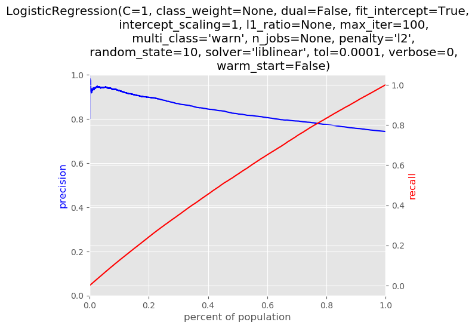
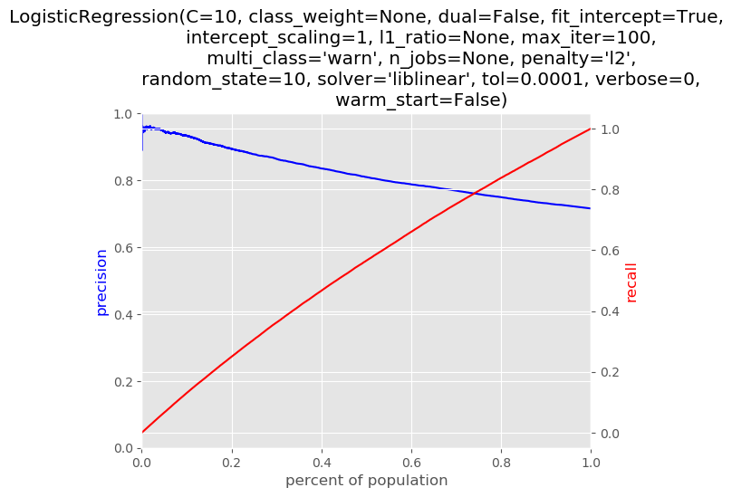

# Project Report
## Si Young Byun

### Overview

__*DonorsChoose.org*__ is an online charity website that allows to help students in need through crowd funding projects. In this project, I looked at past project funding data to build and analyze machine learning models to predict whether a given project will be fully funded within 60 days of posting. A *good* predictive model would allow us to help projects that need help with fulfilling their goals. Specifically, the final goal of the project was to recommend a model that will best identify 5% of posted projects to intervene with.

### Data

The dataset spans from 01/01/2012 to 12/31/2013.

The dataset includes information on various aspects of the project:

- geographical location,
- primary and secondary focus of the project,
- resource type,
- poverty level,
- grade level,
- total price of the project,
- etc.

The outcome/dependent variable was created using `date_posted` and `datefullyfunded`. Specifically, if a project was funded within 60 days, the gap between `date_posted` and `datefullyfunded` would be less than 60 days.

I used the following features to train machine learning models for this project:

- Latitude/longitude of the school,
- The total price of the project,
- The number of students,
- The location of the project (Midwest, Northeast, South, West) -- *a feature created from `school_state`,*
- The area that the school is located in (Urban, Suburban, Rural),
- Whether the school is a charter/magnet school,
- The gender of the teacher -- *a feature created from `teacher_prefix`,*
- The primary focus area of the project,
- The resource type requested by the project,
- The grade level of students,
- Whether the project is eligible for double your impact match.

There were a number of missing values. For categorical features, missing values were imputed by the most frequent value. For continuous features, missing values were imputed by the mean or median depending on the skewness of the feature.

__Before__ preprocessing the data, the dataset was temporally split to take the temporal dimension into account. Specifically, three pairs of train/test datasets were created.

|   | Train Set               | Test Set                |
|---|-------------------------|-------------------------|
| 1 | 2012/01/01 - 2012/05/01 | 2012/07/01 - 2012/12/31 |
| 2 | 2012/01/01 - 2012/11/01 | 2013/01/01 - 2012/06/30 |
| 3 | 2012/01/01 - 2013/05/01 | 2013/07/01 - 2013/12/31 |

### Models

1. Seven classifiers (i.e. Logistic Regression, K-Nearest Neighbor, Decision Trees, SVM, Random Forests, Adaboosting, and Bagging) have been used to identify the best model for this project. Multiple combinations of parameters were tested for each classifier to find the parameters that produced the highest precision score for each classifier.

2. After tuning for parameters, different evaluation metrics (accuracy, precision at different levels, recall at different levels, F1, Area under Curve) were measured for each classifier.

3. Finally, the best model was selected by looking at the model with the highest `Precision_at_5%` score *as it is important to ensure that high proportion of positive identifications is actually correct in order to utilize the limited resources efficiently.* In an ideal world, all projects identified by my model would __NOT__ be funded within 60 days without interventions. Since I had three different train/test sets, I would have at most three different *best* models.

### Results and Recommendations

Since I had three different train/test sets, I would have at most three different *best* models.
The following is the evaluation table of candidate models for the first train/test sets:

|model   |parameters                                                                           |Accuracy          |F1                |ROC_AUC           |Precision_at_1%   |Recall_at_1%        |Precision_at_2%   |Recall_at_2%        |Precision_at_5%   |Recall_at_5%        |Precision_at_10%  |Recall_at_10%      |Precision_at_20%  |Recall_at_20%      |Precision_at_30%  |Recall_at_30%     |Precision_at_50%  |Recall_at_50%     |
|--------|-------------------------------------------------------------------------------------|------------------|------------------|------------------|------------------|--------------------|------------------|--------------------|------------------|--------------------|------------------|-------------------|------------------|-------------------|------------------|------------------|------------------|------------------|
|LR      |{'C': 1, 'penalty': 'l2', 'random_state': 10, 'solver': 'liblinear'}                 |0.7329009074852305|0.8408080294752891|0.6420217385685597|0.9207317073170732|0.012376541945002255|0.9207317073170732|0.02475308389000451 |0.9128580134064594|0.061390926601368793|0.8924763935424916|0.12007704602270398|0.8728490939546216|0.23490840539322158|0.8533143843264643|0.3444940781115528|0.8198428649735063|0.5516577189459448|
|SVM     |{'C': 1, 'dual': False, 'loss': 'squared_hinge', 'penalty': 'l2', 'random_state': 10}|0.7415189719227724|0.8492040932347925|0.6282060592077756|0.9329268292682927|0.012540469652883078|0.9176829268292683|0.024671120036064097|0.8982327848872639|0.060407360354083846|0.8824246116356991|0.11872464243268718|0.8617329069590376|0.23191672472439653|0.8434676682570298|0.3405188311954428|0.8125342590900786|0.5467398877095201|
|RF      |{'max_features': 20, 'random_state': 10}                                             |0.6974846214751202|0.808001546192501 |0.6138535782927267|0.8932926829268293|0.0120077046022704  |0.8810975609756098|0.02368755378877915 |0.8756855575868373|0.05889102905618622 |0.8778556198598843|0.11810991352813409|0.8541190802497335|0.22986762837588623|0.8367678408283423|0.3378140240154092|0.8064437541872221|0.5426416950124995|
|BG      |{'max_samples': 0.1, 'n_estimators': 2, 'random_state': 10}                          |0.6967233083622633|0.8124588064704441|0.5491122905139003|0.75              |0.01008155403467071 |0.7439024390243902|0.019999180361460596|0.7629494210847044|0.05130937256669808 |0.7706366128540969|0.10368427523462154|0.7720420283234354|0.20777836973894512|0.7782966196325246|0.3142084340805705|0.7758694195748828|0.522068767673456 |
|KNN     |{'metric': 'manhattan', 'n_neighbors': 2, 'weights': 'uniform'}                      |0.7049759425056337|0.8192334962868978|0.5443757764956743|0.774390243902439 |0.01040940945043236 |0.7591463414634146|0.020408999631162657|0.7568555758683729|0.050899553296996025|0.7590618336886994|0.1021269620097537 |0.7627531597380843|0.20527847219376255|0.7699725916150645|0.3108479160690136|0.7716060661428833|0.5192000327855416|
|DT      |{'criterion': 'entropy', 'max_depth': 50, 'max_features': 30, 'random_state': 10}    |0.6286619160728424|0.7413676083821158|0.5458293331185453|0.7378048780487805|0.009917626326789886|0.7484756097560976|0.020122126142371213|0.7525898842169408|0.05061267980820458 |0.7544928419128846|0.1015122331052006 |0.7633622658748287|0.20544239990164337|0.766013602679931 |0.3092496209171755|0.7702661550642548|0.518298430392197 |
|Baseline|{'strategy': 'uniform'}                                                              |0.7430720506730008|0.8526004996593232|0.5               |0.75              |0.01008155403467071 |0.7362804878048781|0.019794270726609567|0.7282145033516149|0.048973402729396334|0.7343892780992994|0.098807425925167  |0.7428049337597076|0.19990983976066554|0.7411430311643488|0.299209048809475 |0.7400572507460869|0.4979713946149748|

The table shows that all models perform better than the baseline classifier in terms of `Precision_at_5%` with the logistic regression classifier of `'C': 1, 'penalty': 'l2'` performing the best. The below shows the precision-recall curve of this logistic regression model.

Similarly, the following is the evaluation table of candidate models for the second train/test sets:

|model   |parameters                                                                           |Accuracy          |F1                |ROC_AUC           |Precision_at_1%   |Recall_at_1%        |Precision_at_2%   |Recall_at_2%        |Precision_at_5%   |Recall_at_5%        |Precision_at_10%  |Recall_at_10%      |Precision_at_20%  |Recall_at_20%      |Precision_at_30%  |Recall_at_30%     |Precision_at_50%  |Recall_at_50%     |
|--------|-------------------------------------------------------------------------------------|------------------|------------------|------------------|------------------|--------------------|------------------|--------------------|------------------|--------------------|------------------|-------------------|------------------|-------------------|------------------|------------------|------------------|------------------|
|LR      |{'C': 10, 'penalty': 'l2', 'random_state': 10, 'solver': 'liblinear'}                |0.6883483900857077|0.8122680210978707|0.6441894734592795|0.8232558139534883|0.011969973625481842|0.8468677494199536|0.024683843916954083|0.8721037998146431|0.06363697842699668 |0.8577386468952733|0.12517752079529315|0.8241834607366226|0.24061675796307566|0.8058687258687258|0.3528775275579901|0.774184581171238 |0.5650233313045242|
|SVM     |{'C': 1, 'dual': False, 'loss': 'squared_hinge', 'penalty': 'l1', 'random_state': 10}|0.6864025943942552|0.8130368733600332|0.6242001827539767|0.8418604651162791|0.012240481504023805|0.851508120649652 |0.02481909785622506 |0.8554216867469879|0.06241969297355786 |0.8359592215013901|0.1219990532224251 |0.8056520731989808|0.23520660039223643|0.7908880308880308|0.34631771150334756|0.7611193476649369|0.5554879285859201|
|RF      |{'max_features': 25, 'random_state': 10}                                             |0.6719944405837387|0.787527759438209 |0.6230154424066222|0.8372093023255814|0.012172854534388313|0.8538283062645011|0.024886724825860553|0.8229842446709916|0.06005274903631568 |0.840129749768304 |0.12260769594914452|0.8126013435255964|0.23723540948130115|0.7981467181467181|0.3494961790762156|0.7648257968865827|0.5581930073713397|
|BG      |{'max_samples': 0.1, 'n_estimators': 2, 'random_state': 10}                          |0.6655547834144081|0.7858943559628674|0.5612044170299553|0.772093023255814 |0.011226076959491444|0.7494199535962877|0.021843511192263475|0.7553290083410565|0.055115980252924864|0.7469879518072289|0.1090146750524109 |0.7347695158675006|0.2145127476837763 |0.7278764478764479|0.31872590789206734|0.7289659006671608|0.5320213701224048|
|DT      |{'criterion': 'entropy', 'max_depth': 50, 'max_features': 25, 'random_state': 10}    |0.6168635626592541|0.7239468589358435|0.5483459217186888|0.7069767441860465|0.010279299384594577|0.703016241299304 |0.020490971799553663|0.7043558850787767|0.05139649692297288 |0.7085264133456904|0.10340163657266518|0.7143849895760945|0.20856157435585312|0.7142857142857143|0.3127747345641442|0.7159006671608599|0.5224859674038006|
|KNN     |{'metric': 'manhattan', 'n_neighbors': 2, 'weights': 'uniform'}                      |0.6617095205003475|0.7864412728123539|0.5428237488965851|0.6930232558139535|0.010076418475688104|0.6890951276102089|0.02008520998174072 |0.6895273401297498|0.050314465408805034|0.7099165894346617|0.10360451748157165|0.7180912670836229|0.20964360587002095|0.7175289575289575|0.3141949009264895|0.7168272794662713|0.5231622371001555|
|Baseline|{'strategy': 'uniform'}                                                              |0.6850590687977762|0.8130979874628835|0.5               |0.6325581395348837|0.009197267870426726|0.6635730858468677|0.01934131331575032 |0.6663577386468953|0.04862379116791776 |0.6677479147358666|0.097450463244742  |0.6726893676164003|0.1963887198214648 |0.6741312741312742|0.2951917224589166|0.6793921423276501|0.4958409413674173|

The table shows that all models perform better than the baseline classifier in terms of `Precision_at_5%` with the logistic regression classifier of `'C': 10, 'penalty': 'l2'` performing the best. The below shows the precision-recall curve of this logistic regression model.

Finally, the following is the evaluation table of candidate models for the third train/test sets:

|model   |parameters                                                                           |Accuracy          |F1                |ROC_AUC           |Precision_at_1%   |Recall_at_1%        |Precision_at_2%   |Recall_at_2%        |Precision_at_5%   |Recall_at_5%        |Precision_at_10%  |Recall_at_10%      |Precision_at_20%  |Recall_at_20%      |Precision_at_30%  |Recall_at_30%     |Precision_at_50%  |Recall_at_50%     |
|--------|-------------------------------------------------------------------------------------|------------------|------------------|------------------|------------------|--------------------|------------------|--------------------|------------------|--------------------|------------------|-------------------|------------------|-------------------|------------------|------------------|------------------|------------------|
|LR      |{'C': 10, 'penalty': 'l2', 'random_state': 10, 'solver': 'liblinear'}                |0.7129983924649625|0.8274012145638735|0.655969868660173 |0.9138321995464853|0.012755182782085773|0.9161947904869762|0.025605317297040672|0.9085144927536232|0.0634910587118215  |0.8876811594202898|0.12407026428232315|0.8609758858824861|0.24070264282323153|0.8401509433962264|0.35233423009969933|0.8099443010460535|0.5661022313657225|
|SVM     |{'C': 1, 'dual': False, 'loss': 'squared_hinge', 'penalty': 'l1', 'random_state': 10}|0.714922906242217 |0.8322385514236607|0.6426957317086371|0.9047619047619048|0.012628580471593607|0.9105322763306908|0.02544706440892546 |0.8971920289855072|0.06269979427124545 |0.8734148550724637|0.12207627789207152|0.8485225857579531|0.23722107928469693|0.8307169811320755|0.3483779078968191|0.8007517094597655|0.559677164108245 |
|RF      |{'max_features': 35, 'random_state': 10}                                             |0.6944324948490955|0.8040764183264618|0.6409772012621764|0.873015873015873 |0.012185472384871023|0.8878822197055493|0.02481405285646463 |0.8876811594202898|0.062035132141161575|0.8833786231884058|0.12346890330748536|0.8572398958451263|0.23965817376167114|0.8387924528301887|0.35176451970248457|0.8001177376262283|0.5592340560215224|
|BG      |{'max_samples': 0.1, 'n_estimators': 2, 'random_state': 10}                          |0.6920325129621663|0.8076150603943313|0.5739291130784104|0.7505668934240363|0.010476341193226777|0.766704416761042 |0.021427441050799176|0.7758152173913043|0.0542174394682703  |0.7789855072463768|0.10887798702326318|0.7755009623004642|0.2168064567178351 |0.7735849056603774|0.3244184206361766|0.7670153511751121|0.536097483779079 |
|KNN     |{'metric': 'manhattan', 'n_neighbors': 2, 'weights': 'uniform'}                      |0.6920777956392782|0.8095024652622143|0.5573822945681899|0.7482993197278912|0.010444690615603734|0.7565118912797282|0.0211425858521918  |0.7531702898550725|0.052634910587118215|0.7533967391304348|0.10530147175185947|0.7537642929921884|0.2107295458142111 |0.7564528301886793|0.3172337395157462|0.754969886337907 |0.5276784301313499|
|DT      |{'criterion': 'gini', 'max_depth': 60, 'max_features': 30, 'random_state': 10}       |0.6265311205198452|0.7337497780575597|0.5562059048820085|0.7097505668934241|0.009906630796012027|0.7474518686296716|0.02088938123120747 |0.7468297101449275|0.05219180250039563 |0.7506793478260869|0.10492166482038297|0.7487829729423752|0.20933692039879728|0.7523018867924528|0.3154929577464789|0.7502150975863786|0.5243551194809305|
|Baseline|{'strategy': 'uniform'}                                                              |0.7153530916747798|0.8340592909374093|0.5               |0.7210884353741497|0.010064883684127236|0.7259343148357871|0.02028802025636968 |0.7228260869565217|0.050514321886374426|0.7185235507246377|0.10042728279791106|0.7162911807992755|0.20025320462098434|0.7151698113207547|0.2999208735559424|0.717791966671195 |0.5016933059028327|

Again, the table shows that all models perform better than the baseline classifier in terms of `Precision_at_5%` with the logistic regression classifier of `'C': 10, 'penalty': 'l2'` performing the best. The below shows the precision-recall curve of this logistic regression model.

Looking at all three `best` models across the time, it seems like the logistic regression classifier model seems to work best in terms of `Precision_at_5%`. In fact, it consistently outperforms other classifiers over time. Specifically, I recommend using the logistic regression classifier of `'C': 10, 'penalty': 'l2'`, which scored the highest in `Precision_at_5%` for the second and third train/test sets for deployment.
